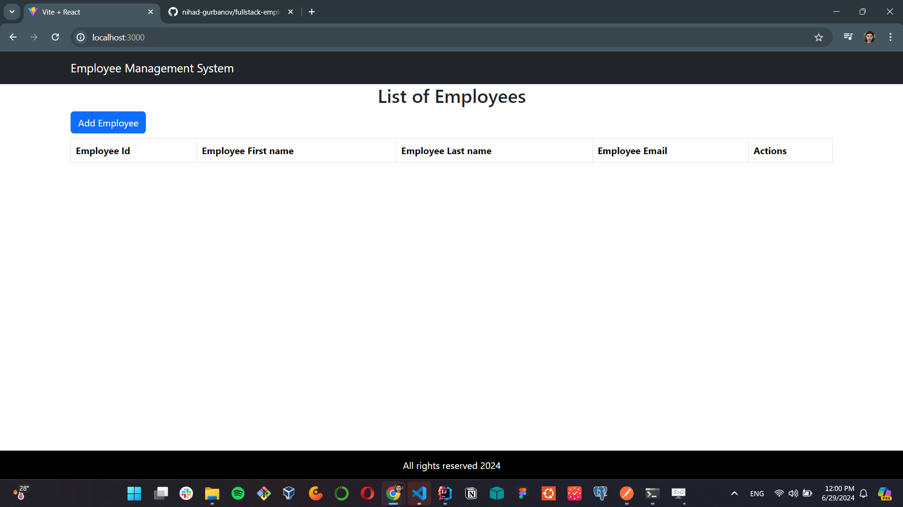
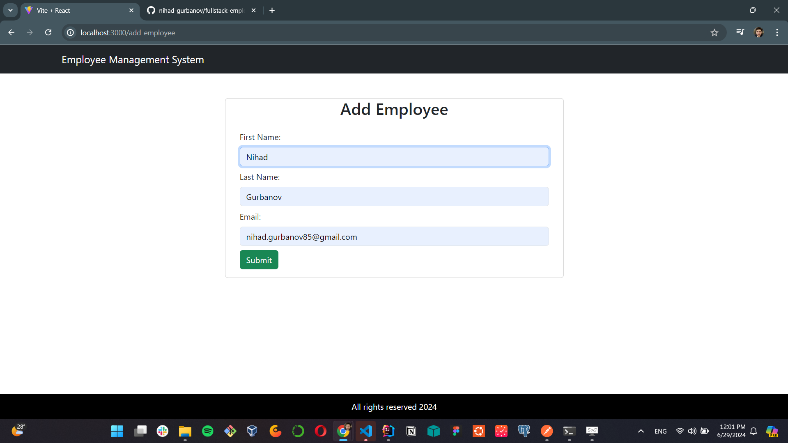
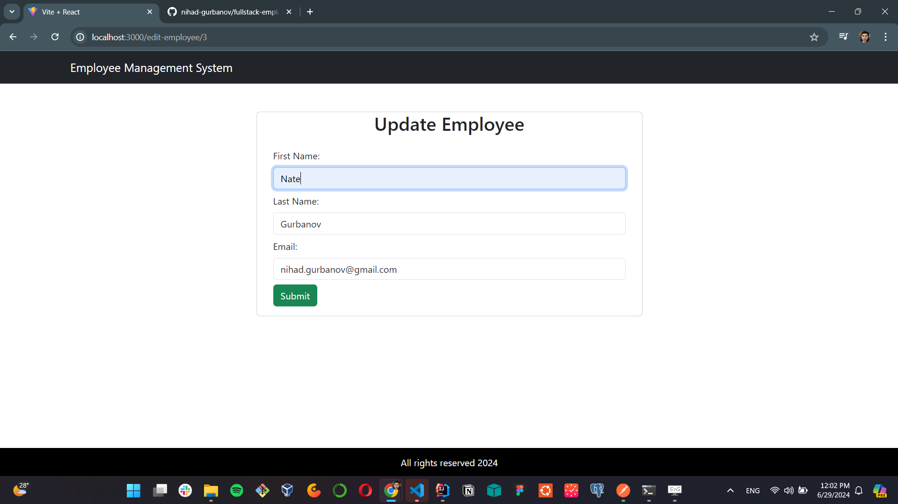

# Fullstack Employee Management System

This is a fullstack employee management system built using Spring Boot for the backend and React for the frontend. The system allows for managing employee data including creating, reading, updating, and deleting employee records. The backend uses MySQL for data persistence.

## Table of Contents

- [Features](#features)
- [Tech Stack](#tech-stack)
- [Installation](#installation)
- [Usage](#usage)
- [Endpoints](#endpoints)
- [Screenshots](#screenshots)

## Features

- Add new employees
- View a list of all employees
- Update employee details
- Delete employees
- Responsive design

## Tech Stack

**Frontend:**
- React
- Axios

**Backend:**
- Spring Boot
- Spring Data JPA
- MySQL

## Installation

### Prerequisites

- Java 11 or higher
- Node.js and npm
- MySQL

### Backend Setup

1. Clone the repository:
    ```bash
    git clone https://github.com/nihad-gurbanov/fullstack-employee-management-system.git
    cd fullstack-employee-management-system/backend
    ```

2. Configure MySQL:
    - Create a new database called `ems`.
    - Update the `application.properties` file with your MySQL username and password.
    ```properties
    spring.datasource.url=jdbc:mysql://localhost:3306/ems
    spring.datasource.username=YOUR_MYSQL_USERNAME
    spring.datasource.password=YOUR_MYSQL_PASSWORD
    ```

3. Build and run the Spring Boot application:
    ```bash
    ./mvnw spring-boot:run
    ```

### Frontend Setup

1. Navigate to the frontend directory:
    ```bash
    cd ../frontend
    ```

2. Install dependencies:
    ```bash
    npm install
    ```

3. Start the React application:
    ```bash
    npm start
    ```

## Usage

- Open your browser and go to `http://localhost:3000` to access the frontend.
- The backend API will be running on `http://localhost:8080`.

## Endpoints

### Employee Endpoints

- `GET /api/employees` - Get all employees
- `GET /api/employees/{id}` - Get an employee by ID
- `POST /api/employees` - Create a new employee
- `PUT /api/employees/{id}` - Update an existing employee
- `DELETE /api/employees/{id}` - Delete an employee

## Screenshots



*Screenshot of the employee management dashboard.*



*Screenshot of the add employee page.*



*Screenshot of the edit employee page.*